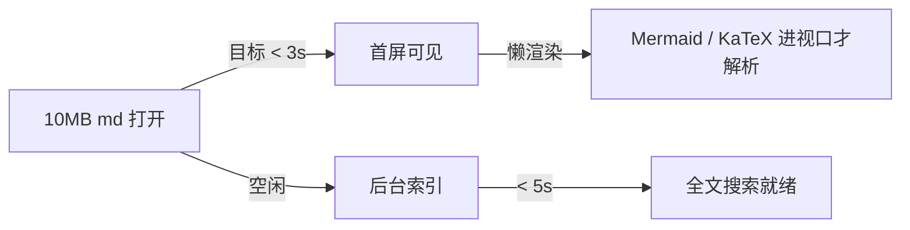
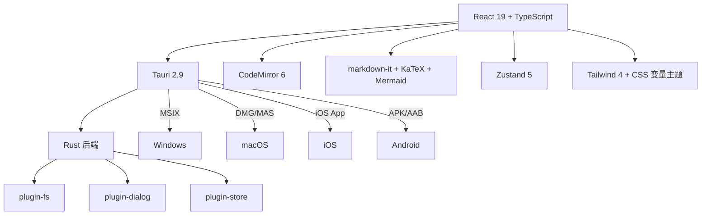

# markio · 产品 & 技术设计

> 一款轻量、美观、多端的 Markdown 阅读 / 编辑器 —— 兼顾 Typora 的所见即所得与 Obsidian 的仓库式管理。

- **产品代号**：markio
- **桌面 Bundle ID**：`com.welape.mdview`
- **目标平台**：macOS · Windows · iOS · Android（Linux 作为副产物）

---

## 1. 产品定位

| 项 | 说明 |
| --- | --- |
| **形态** | 仓库式（指向本地文件夹），不强制单一笔记库 |
| **核心** | 美观、流畅、跨端，本地优先 + 可选同步 |
| **不做** | 双向链接图谱、插件市场（首版） |
| **对标** | Typora（阅读体验）、Obsidian（仓库管理）、Bear（视觉） |

---

## 2. 功能矩阵

### 2.1 已规划（MVP 完成对勾）

- [x] 多仓库加载、切换、移除（独立持久化）
- [x] 文件树（折叠、过滤、文件夹剪枝）
- [x] 多 Tab 同时打开（脏标、关闭、切换）
- [x] 编辑 / 预览 / 对照 三种模式切换
- [x] 对照模式双向同步滚动
- [x] 全局搜索（文件名 + 异步全文 scan）
- [x] 数学公式（KaTeX）行内 + 块级
- [x] Mermaid 流程图（懒渲染，跟主题切换重绘）
- [x] 代码块语法高亮（highlight.js，主题感知）
- [x] 任务列表、脚注、高亮、表格、GFM
- [x] 8 套内置主题（含 GitHub / Solarized / Nord / Dracula）
- [x] CSS 变量驱动主题，编辑器 / 预览统一切换
- [x] 快捷键：`⌘P` 搜索、`⌘S` 保存

### 2.2 V1（上架前必做）

- [ ] 自定义主题导入（**仅 CSS**，无 JS，规避 Apple 4.7）
- [ ] PicGo 集成（PicGo-Core，配置即用）
- [ ] 回收站（软删除 + 30 天保留，独立 `.markio/trash/`）
- [ ] 命令面板（`⌘⇧P`，所有动作可命中）
- [ ] Git 同步（isomorphic-git，提交 / 拉取 / 冲突 UI）
- [ ] WebDAV 同步（坚果云 / Nextcloud / 自建）
- [ ] 文件 / 文件夹的右键操作（新建、重命名、删除、复制路径）
- [ ] 大纲（TOC）侧栏
- [ ] 拖拽插入图片（自动上传 + 本地缓存）

### 2.3 V2（差异化）

- [ ] SMB 同步（**仅桌面**，iOS 沙盒禁直连）
- [ ] iCloud Drive / Files 集成（iOS / macOS）
- [ ] 全文索引（SQLite FTS5，毫秒级搜索）
- [ ] 笔记内反链与悬浮预览
- [ ] 导出 PDF / HTML / 图片
- [ ] AI 对话改写（按选区 / 整篇）

---

## 3. 页面结构

```
┌──────────────────────────────────────────────────────────────────┐
│  TitleBar  [path/file • ]              [模式切换] [💾] [🔍] [🎨]  │  ← 11px
├──────────┬───────────────────────────────────────────────────────┤
│ 仓库 ▾   │  tab1 ● │ tab2 │ tab3 │ +                              │
│ ─────── │ ───────────────────────────────────────────────────────│
│ [过滤..] │                                                       │
│ ▼ docs   │       编辑区 (CM6)        │       预览区             │
│   ▸ api  │   ┌────────────────────┐  │  ┌────────────────────┐  │
│   • DESI │   │  # 标题             │  │  │  # 标题             │  │
│ ▼ notes  │   │                    │  │  │                    │  │
│   • idea │   │  ```mermaid        │  │  │  [流程图]           │  │
│          │   │  ...               │  │  │                    │  │
│          │   │  ```               │  │  │  ─ 同步滚动 ─       │  │
│          │   └────────────────────┘  │  └────────────────────┘  │
├──────────┴───────────────────────────────────────────────────────┤
│ 仓库路径 | 文件路径          120 行  450 词  2.3 KB  主题: dark   │  ← 6px
└──────────────────────────────────────────────────────────────────┘
```

### 关键交互

| 区域 | 交互 |
| --- | --- |
| 仓库下拉 | 点击切换 / 删除 / 加载新仓库 |
| 文件树 | 单击打开（复用 Tab）/ 双击固定 / 右键菜单 |
| Tab 栏 | 点击切换、中键关闭、拖拽排序、`⌘W` 关闭 |
| 模式 | `⌘1` 编辑 / `⌘2` 对照 / `⌘3` 预览 |
| 搜索 | `⌘P` 文件名命令面板，`⌘⇧F` 内容 grep |
| 主题 | 点击 🎨 立即生效，编辑器 + 预览 + Mermaid 同步 |

---

## 4. 主题系统

所有颜色走 CSS 变量，挂在 `[data-theme="xxx"]` 上。切换主题 = 改 `html` 的 `data-theme`，无需重建 React 组件。

**核心 token**：

```css
--color-bg / --color-panel / --color-sidebar
--color-fg / --color-muted / --color-heading
--color-border / --color-hover / --color-active
--color-accent / --color-accent-fg / --color-selection
--color-code-bg / --color-code-fg / --color-link
```

| 主题 | 适用场景 |
| --- | --- |
| Light / Dark | 默认 |
| GitHub Light / Dark | 开发者熟悉 |
| Solarized Light / Dark | 长时间阅读护眼 |
| Nord | 北欧冷调 |
| Dracula | 重度夜间 |

**自定义主题**导入策略（V1）：用户从设置面板选 `.css` 文件 → 解析 → 注入到 `<style data-custom-theme>` → 仅允许 `--color-*` 变量与 `.markio-*` 命名空间，DOMPurify 过滤 `expression()`、`@import url(http*)`、`url(javascript:)`。

> Apple 审核 4.7 准则禁止"从远程下载可执行代码"。**自定义主题严格限定 CSS**，禁含 `<script>` / JS URL / 动态 @import，从设计层规避被拒。

---

## 5. 大文件流畅性策略

### 5.1 编辑器侧

- **CodeMirror 6**：自带 viewport rendering，10MB 文档仍流畅
- **行折叠 + 大纲**：默认折叠 `#` 以下层级
- **延迟语法高亮**：滚出视口的代码块卸载高亮

### 5.2 预览侧

- **解析防抖**：`onChange` → 80ms 后才重渲（编辑高频时不卡）
- **Web Worker 化（V1）**：markdown-it 解析放 worker，主线程只负责绘制
- **懒渲染**：Mermaid / KaTeX 按 IntersectionObserver 进入视口才执行
- **分块挂载**：超长文档按 H1/H2 切块，未滚到的块只占位
- **AST 缓存**：未变化的子树跳过重渲

### 5.3 搜索侧

- **本地索引**：SQLite FTS5（V2），仓库变更触发增量更新
- **MVP**：流式 grep，遇命中即推送结果，前 80 条停

### 性能基准



---

## 6. 数据存储

```
~/Library/Application Support/markio/        # macOS
%APPDATA%/markio/                            # Windows
└── store.bin                               # tauri-plugin-store: 仓库列表 / 设置 / 主题
└── cache/
    └── <workspace-id>/
        ├── index.sqlite                    # FTS5 索引（V2）
        └── thumbnails/                     # 图片缩略图

<workspace>/.markio/                        # 写在用户仓库内部
├── trash/                                  # 回收站
│   └── 2026-05-12/file.md.json
├── theme/                                  # 仓库级自定义主题（可选）
└── picgo.json                              # 图床配置（可选，跟仓库走）
```

仓库元数据从不离开本地（除非用户配置 Git/WebDAV 同步整个目录）。

---

## 7. 同步策略

| 协议 | 桌面 | iOS | Android | 实现 |
| --- | --- | --- | --- | --- |
| **Git** | ✅ | ✅ | ✅ | `isomorphic-git`，纯 JS 全平台 |
| **WebDAV** | ✅ | ✅ | ✅ | `webdav` npm，HTTPS Basic Auth |
| **SMB** | ✅ | ❌ | ⚠️ | 桌面调用系统挂载，iOS 走 Files |
| **iCloud Drive** | ✅ | ✅ | ❌ | 系统 Document Picker |
| **WebDrive（第三方云）** | V2 | V2 | V2 | OneDrive / Google Drive OAuth |

冲突处理：**始终保留远端** + **写入冲突副本** `file.conflict-20260512-1430.md`，弹通知让用户人工合并。不做自动 merge（markdown 行级 merge 不可靠）。

---

## 8. 跨平台兼容矩阵

| 功能 | macOS | Windows | iOS | Android |
| --- | --- | --- | --- | --- |
| 多 Tab | ✅ | ✅ | ⚠️ Drawer 替代 | ⚠️ Drawer 替代 |
| 对照模式 | ✅ | ✅ | ❌ 切换替代 | ❌ 切换替代 |
| 自定义快捷键 | ✅ | ✅ | — | — |
| 自定义主题 | ✅ JS+CSS | ✅ JS+CSS | ⚠️ 仅 CSS | ⚠️ 仅 CSS |
| PicGo 图床 | ✅ | ✅ | ✅ | ✅ |
| SMB | ✅ | ✅ | ❌ | ⚠️ |
| Git 同步 | ✅ | ✅ | ✅ | ✅ |

移动端首版定位为**阅读优先**，编辑能力子集化。

---

## 9. 商店审核要点

### 9.1 Apple App Store / Mac App Store

| 准则 | 风险 | 应对 |
| --- | --- | --- |
| 4.7 远程执行代码 | 🔴 高 | 自定义主题禁 JS；Mermaid 用 `securityLevel: 'strict'` |
| 5.1.1 隐私 | 🟡 中 | `PrivacyInfo.xcprivacy` 列清楚 WebDAV/Git/PicGo |
| 3.1.1 支付 | 🟡 中 | 移动端会员必须走 IAP |
| Sandbox | 🟡 中 | macOS 走 Security-Scoped Bookmark |
| WKWebView 加载远程脚本 | 🔴 高 | 所有 JS 随包发布，禁热更新 |

### 9.2 Microsoft Store

- MSIX 打包，Tauri 已原生支持
- 审核宽松，主要避免捆绑恶意 SDK

### 9.3 Google Play

- `targetSdk` 跟上每年要求
- 隐私政策列清楚网络去向

---

## 10. 技术栈



| 维度 | 选型 | 理由 |
| --- | --- | --- |
| 框架 | **Tauri 2** | 体积 ~10MB，启动快，原生 WebView |
| 前端 | **React 19 + TS** | 生态、可维护性 |
| 编辑器 | **CodeMirror 6** | 大文件性能，主题灵活，Obsidian 同款 |
| 渲染 | **markdown-it** + 插件 | 灵活、可扩展、AST 可控 |
| 数学 | **KaTeX** | 比 MathJax 快 10×，无外部字体依赖 |
| 流程图 | **Mermaid 11** | 配置 strict 后可过 Apple 审核 |
| 状态 | **Zustand 5** | 轻量、TS 友好、可持久化 |
| 样式 | **Tailwind 4** | CSS-first 配置，零 JS 运行时 |

---

## 11. 路线图

| 阶段 | 时间 | 目标 |
| --- | --- | --- |
| **MVP** | 已完成 | 仓库 / Tab / 三模式 / 主题 / 搜索 |
| **V1** | 4 周 | PicGo、回收站、Git、WebDAV、自定义主题、右键菜单 |
| **V1.5** | 6 周 | iOS / Android 打包，移动端 UI 适配 |
| **V2** | 10 周 | SMB、FTS5 索引、PDF 导出、反链 |
| **上架** | 12 周 | Microsoft Store → Mac App Store → iOS → Google Play |

---

## 12. 渲染能力一览（同时也是验收 demo）

### 代码块

```ts
function debounce<T extends (...args: any[]) => void>(
  fn: T,
  wait: number,
): T {
  let t: ReturnType<typeof setTimeout> | null = null;
  return ((...args: any[]) => {
    if (t) clearTimeout(t);
    t = setTimeout(() => fn(...args), wait);
  }) as T;
}
```

### 数学公式

行内：$E = mc^2$、$\sum_{i=1}^{n} i = \frac{n(n+1)}{2}$

块级：

$$
\int_{-\infty}^{\infty} e^{-x^2}\,dx = \sqrt{\pi}
$$

$$
A = \begin{pmatrix} a & b \\ c & d \end{pmatrix},\quad \det(A) = ad - bc
$$

### 任务列表

- [x] 三模式 + 同步滚动
- [x] 八套主题
- [ ] PicGo 集成
- [ ] WebDAV 同步

### 表格

| 平台 | 状态 | 优先级 |
| --- | --- | --- |
| macOS | ✅ MVP | P0 |
| Windows | ✅ MVP | P0 |
| iOS | 🔄 V1.5 | P1 |
| Android | 🔄 V1.5 | P1 |

### 引用

> 设计目标是**让仓库管理像 Obsidian，阅读体验像 Typora，启动速度像原生应用**。
>
> —— markio 设计稿，2026-05-12

### 高亮

==这是一段重要的备注==，描述了一个核心约束。

### 脚注

Tauri 2 原生支持移动端打包[^1]，启动包体远小于 Electron[^2]。

[^1]: 自 2024 年 10 月 Tauri 2.0 GA 起。
[^2]: 实测桌面端可达 5-15MB，对比 Electron 80-150MB。

---

## 13. 待你拍板

1. **覆盖范围**：MVP 功能 + V1 同步矩阵 是否符合预期？
2. **审美方向**：当前 8 套主题是否覆盖你想要的风格？
3. **移动端**：首版是否只做阅读，编辑放后？
4. **付费模型**：是否走 IAP？哪些功能进 Pro？
5. **数据策略**：默认仓库结构（`.markio/` 隐藏目录）是否接受？

读完此文档，告诉我哪里要改、哪里要砍、哪里要加，再决定是否动手画细节页面。
